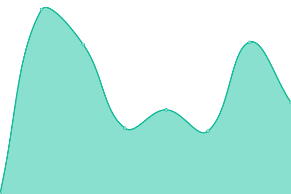
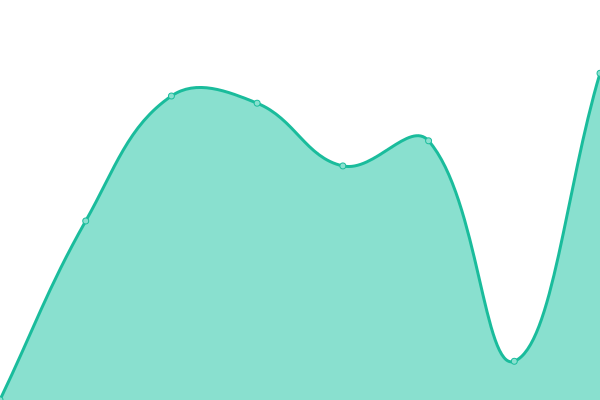
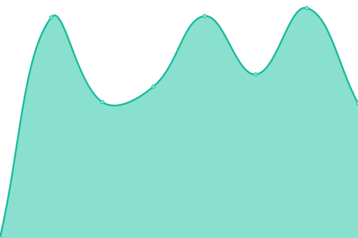
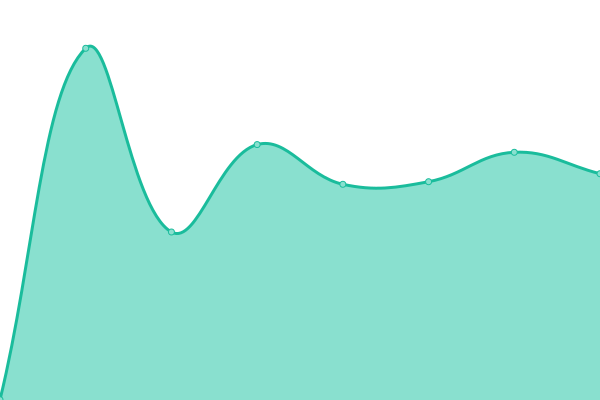

# [📈 Live Status](https://status.ergotopia.de): <!--live status--> **🟩 All systems operational**

This repository contains the open-source uptime monitor and status page for [ergotopia-dev](https://status.ergotopia.de), powered by [Upptime](https://github.com/upptime/upptime).

With [Upptime](https://upptime.js.org), you can get your own unlimited and free uptime monitor and status page, powered entirely by a GitHub repository. We use [Issues](https://github.com/ergotopia-dev/uptime-monitor/issues) as incident reports, [Actions](https://github.com/ergotopia-dev/uptime-monitor/actions) as uptime monitors, and [Pages](https://status.ergotopia.de) for the status page.

<!--start: status pages-->
<!-- This summary is generated by Upptime (https://github.com/upptime/upptime) -->
<!-- Do not edit this manually, your changes will be overwritten -->
<!-- prettier-ignore -->
| URL | Status | History | Response Time | Uptime |
| --- | ------ | ------- | ------------- | ------ |
|  [ergotopia.fr](https://www.ergotopia.fr) | 🟩 Up | [ergotopia-fr.yml](https://github.com/ergotopia-dev/uptime-monitor/commits/HEAD/history/ergotopia-fr.yml) | 

 1184ms
     
 | 

<a href="https://status.ergotopia.de/history/ergotopia-fr">99.14%</a>
    

|  [ergotopia.fr (blog)](https://www.ergotopia.fr/blog) | 🟩 Up | [ergotopia-fr-blog.yml](https://github.com/ergotopia-dev/uptime-monitor/commits/HEAD/history/ergotopia-fr-blog.yml) | 

 446ms
     
 | 

<a href="https://status.ergotopia.de/history/ergotopia-fr-blog">99.84%</a>
    

|  [ergotopia.de](https://www.ergotopia.de) | 🟩 Up | [ergotopia-de.yml](https://github.com/ergotopia-dev/uptime-monitor/commits/HEAD/history/ergotopia-de.yml) | 

 1073ms
     
 | 

<a href="https://status.ergotopia.de/history/ergotopia-de">99.45%</a>
    

|  [ergotopia.de (blog)](https://www.ergotopia.de/blog) | 🟩 Up | [ergotopia-de-blog.yml](https://github.com/ergotopia-dev/uptime-monitor/commits/HEAD/history/ergotopia-de-blog.yml) | 

 401ms
     
 | 

<a href="https://status.ergotopia.de/history/ergotopia-de-blog">99.84%</a>
    

|  [ergotopia.de (API)](https://api.ergotopia.de/check-status) | 🟩 Up | [ergotopia-de-api.yml](https://github.com/ergotopia-dev/uptime-monitor/commits/HEAD/history/ergotopia-de-api.yml) | 

 509ms
     
 | 

<a href="https://status.ergotopia.de/history/ergotopia-de-api">99.01%</a>
    

<!--end: status pages-->

[**Visit our status website →**](https://status.ergotopia.de)

## 📄 License

- Powered by: [Upptime](https://github.com/upptime/upptime)
- Code: [MIT](./LICENSE) © [ergotopia-dev](https://status.ergotopia.de)
- Data in the `./history` directory: [Open Database License](https://opendatacommons.org/licenses/odbl/1-0/)
